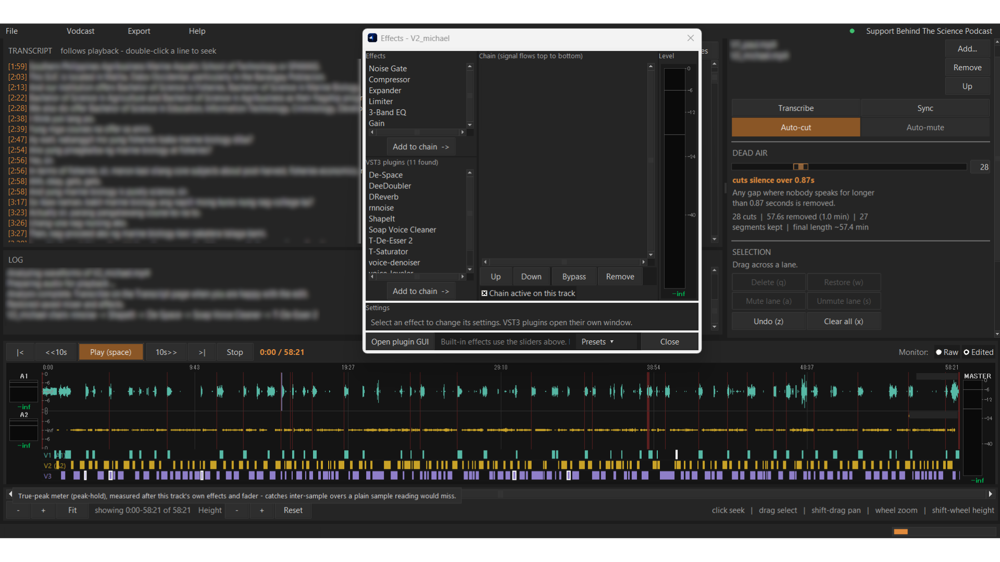

# Wavefield

**Removes the dead air from your podcast recordings, automatically.**

If you record a podcast where each person is on their own audio file — OBS,
Riverside, Zoom, StreamYard — Wavefield listens to each track, finds the long
silences where nobody is talking, and cuts them out. What normally takes an
evening of dragging clips around takes a couple of minutes.

Then it hands you either a **DaVinci Resolve timeline** to finish your video, or
a **finished audio file** ready to upload.

Everything happens on your own computer. No account, no subscription, nothing
uploaded anywhere.



---

## Download

### [⬇ Download Wavefield for Windows](../../releases/latest)

Open the file you downloaded and click through the installer. That's it — you
don't need to install anything else first.

At the end it offers to **set up speech recognition**. Leave that ticked if you
want transcripts and subtitles: it downloads about 2-3 GB in its own window and
takes 5-15 minutes, once. Everything else works without it, and you can always
do it later from **File > Settings**.

> **Windows will show a blue warning box** saying *"Windows protected your PC"*.
> This is normal. It appears for any program whose author hasn't paid for a
> code-signing certificate.
>
> To continue: click **More info**, then **Run anyway**.

### Check your download

Every release lists a **SHA-256** — a long code that acts as a fingerprint for
that exact file. If your copy produces the same code, it is byte-for-byte the
file published here and nobody has altered it on the way to you.

Open PowerShell in your Downloads folder and run:

```powershell
Get-FileHash .\Wavefield-Setup-1.1.0.exe
```

Compare what it prints against the SHA-256 in the
[release notes](../../releases/latest). They should match exactly; upper or
lower case does not matter. If they do not match, delete the file and download
it again from the Releases page — and please
[report it](../../issues).

This is worth doing because Wavefield is not yet code-signed. Until it is, the
checksum is the honest way to tell a real copy from a tampered one.

<details>
<summary><b>The download vanished, or Windows says it found a virus</b> — a false positive</summary>

Microsoft Defender sometimes deletes or quarantines the installer, so the file
simply disappears from your Downloads folder, occasionally with a message about
a trojan.

**This is a false positive, and it is being formally disputed with Microsoft.**
It happens because Wavefield is built with a tool called PyInstaller, which
packs a program and its Python runtime into one executable. Some malware does
the same, so unsigned PyInstaller files get flagged on pattern alone. Code
signing is what ends this for good, and the application for it is pending.

If you would rather not wait, here is how to get the file back — but please do
the middle step, because the whole point is to be sure it is genuinely ours:

1. Open **Windows Security ▸ Virus & threat protection ▸ Protection history**.
2. Find the Wavefield entry, open it, and choose **Actions ▸ Allow on device**.
3. **Before running it, check the SHA-256** as described in
   [Check your download](#check-your-download). If it matches the release
   notes, the file is exactly what was published here.

**Do not turn Defender off.** You never need to, and nothing about Wavefield is
worth doing that for. Allowing one file you have verified is enough.

If you would rather trust nothing you cannot inspect, that is entirely
reasonable — the full source is in this repository and
[docs/DEVELOPERS.md](docs/DEVELOPERS.md) explains how to build the installer
yourself.

</details>

<details>
<summary><b>"An Application Control policy has blocked this file"</b> — a different, harder block</summary>

If you get this instead, with **CreateProcess failed; code 4551**, there is no
"Run anyway" button. Something on that computer is refusing to run *any*
program without a certificate. There are two possibilities, and they need
different answers.

Paste this into PowerShell to find out which:

```powershell
(Get-ItemProperty 'HKLM:\SYSTEM\CurrentControlSet\Control\CI\Policy' -Name VerifiedAndReputablePolicyState -ErrorAction SilentlyContinue).VerifiedAndReputablePolicyState
```

**If it prints `1`** — that is Windows 11's *Smart App Control*, on by default
on computers that shipped with Windows 11. You can turn it off in **Windows
Security ▸ App & browser control ▸ Smart App Control ▸ Off**.

> ⚠️ Read this first: **Smart App Control cannot be turned back on** without
> reinstalling Windows. Microsoft made it one-way on purpose. Don't disable it
> on a computer you rely on just to try this app — use a different machine
> instead.

**If it prints nothing, or `0`** — Smart App Control isn't the cause, so the
block is coming from a policy your **IT department** set (common on work
laptops). You cannot switch that off yourself, and shouldn't try. Ask IT to
allow the app, or use a personal computer.

</details>

Windows only for now. About 100 MB.

---

## How to use it

### 1. Add your recordings

Click **Add...** and pick each person's audio or video file.

**Put the host first.** The order matters — the first file becomes track 1, the
second becomes track 2, and so on.

Everyone's recording must start at the same moment, which is what OBS and
Riverside give you automatically.

### 2. Wait a moment

There's nothing to press. As soon as you add a recording, Wavefield reads it and
works out when each person is speaking.

The first time it sees a file it has to read the whole recording, so give it a
few minutes for an hour-long episode. After that it's quick. The bar at the
bottom of the window shows how it's getting on, and the **LOG** panel on the
left says what it's doing.

### 3. Choose how aggressive to be

The **DEAD AIR** slider decides how long a pause has to be before it gets cut.

- Slide **left** — only removes long, obvious silences
- Slide **right** — tightens everything up, cutting even short pauses

The waveform updates as you drag, shading the doomed sections red, so you can
see exactly what you're about to lose before committing to it.

### 4. Listen, and fix anything wrong

Each person gets their own waveform lane. Click anywhere to jump there, press
**space** to play.

If Wavefield got something wrong, drag across the waveform to select it, then:

| To do this | Press |
|---|---|
| Cut the selected part | `q` |
| Put it back | `w` |
| Silence one person there | `a` |
| Unsilence them | `s` |
| Undo | `z` |

Tick **Auto-mute inactive speaker** to silence each microphone whenever its
owner isn't talking. That removes background noise, breathing and keyboard
clatter from whoever is listening.

### 5. Make it sound better (optional)

Every track has an **FX** button. Wavefield has six studio effects built in -
the same ones OBS gives you, with the same settings:

| Effect | What it does |
|---|---|
| Noise Gate | Silences the mic between sentences |
| Compressor | Evens out someone who goes loud and quiet |
| Expander | Pushes down quiet background noise without cutting it off |
| Limiter | Stops the loudest moments distorting |
| 3-Band EQ | Adjusts tone - more warmth, less boominess |
| Gain | Makes the whole track louder or quieter |

It also installs **rnnoise**, which removes background hiss, fans and air
conditioning. A good starting order for a voice: **rnnoise -> Noise Gate ->
Compressor -> 3-Band EQ -> Limiter**.

Once a track sounds right, save the chain with **Presets** at the bottom of the
Effects window. It will be there for every future episode, so you only have to
get it right once.

Every setting has a box beside its slider, so you can type an exact value
instead of trying to land on it by dragging.

If you already own other VST3 plugins, they appear in the list underneath and
work the same way.

### 6. Video podcast? Let it switch cameras for you

If you filmed the interview, Wavefield can cut between cameras on its own -
whoever is talking is who you see.

You need three recordings that start together and run the same length:

| | |
|---|---|
| **V1** | the host, on their own |
| **V2** | the guest, on their own |
| **V3** | the shot with both of them in frame |

Add V1 and V2 as your two recordings, then **Vodcast > Set merged video
(V3)...** and tick **Switch cameras automatically**. V3's sound is ignored - it
is the same two voices again, and would double every word.

The rules are simple: host talking, you see V1. Guest talking, V2. Both talking
at once, or nobody, V3.

A **CAMERAS** strip appears under the waveforms with a row per camera. To
override a stretch, drag along the row of the camera you want - the same drag
you already use for selecting audio. **Vodcast > Shot length...** sets how long it
must stay on one camera (so a quick "mm-hm" doesn't cause a jump cut) and how
long before it cuts away to V3 for variety. **Regenerate camera switching**
throws your overrides away and starts again from the audio.

Export this with *Finished video (MP4)*. The Resolve timeline can't carry
camera switching - Resolve rearranges what it is given - so that option greys
out while switching is on.

### 7. Export

From the **Export** menu:

**Making a video podcast?** Choose *Timeline for DaVinci Resolve*. Then in
Resolve: `File ▸ Import ▸ Timeline ▸ Import AAF, EDL, XML...` — your cut episode
appears, ready to colour and add graphics to.

**Want a finished video without opening an editor?** Choose *Finished video
(MP4)*. Wavefield renders the cut - camera switching included - straight to a
file you can upload. It uses your graphics card if it can, which is several
times faster.

**Making an audio podcast?** Choose *Finished audio (WAV)*. Everything is
already applied — cuts, effects, levels. Upload it and you're done.

You can add intro and outro music from the same menu.

---

## Saving your work

**File ▸ Save project** keeps your recordings, your edits and your effect
settings together, so you can come back later. Wavefield also saves as you go,
and offers to recover everything if it ever crashes.

---

## If something goes wrong

**No sound when I press play**
Wavefield uses whatever speakers Windows is set to. Change it in Windows sound
settings, then restart Wavefield.

**Reading the recordings seems stuck**
The first pass on a long recording genuinely takes a few minutes. The LOG panel
shows what is happening — if it is still moving, it is still working.

**It cut something it shouldn't have**
Drag across that part of the waveform and press `w` to put it back. Or move the
DEAD AIR slider left, and it will be less aggressive everywhere.

**It closed by itself**
An audio effect can occasionally crash the program. Use **Help ▸ Report a
problem** — it writes a file describing what went wrong, including the crash
log, and opens the folder it saved to. Sending that makes it far easier to work
out why.

---

## Transcripts

Press **Transcribe** and Wavefield asks which language and which model, then
writes the transcript. It can write subtitle files alongside your export too,
and handles 100 languages including Filipino and Taglish.

It is a separate button rather than something that happens by itself, because
it takes minutes even on a good graphics card and plenty of episodes never need
one.

The installer sets this up for you - leave the **"Set up speech recognition"**
box ticked at the end of setup. It downloads about 2-3 GB and takes 5-15
minutes, and only ever happens once. If you have an NVIDIA graphics card it
installs the version that uses it, which is several times faster.

Skipped it, or lost your connection halfway? Open **File > Settings** and press
**Install WhisperX** to run the same setup again.

Everything else in Wavefield works without this.

---

## Support the podcast

Wavefield was built to make [Behind The Science
Podcast](https://www.facebook.com/btspodcastph) easier to produce, and it's free
for anyone else to use.

If it saves you time, you can support the show:

- ☕ [Buy me a coffee](https://buymeacoffee.com/btspodcastph)
- ▶ [YouTube](https://www.youtube.com/@marineearthscience)
- 🎧 [Spotify](https://open.spotify.com/show/4NTLrSfceKjpFvZWflzBJj)
- 📘 [Facebook](https://www.facebook.com/btspodcastph)

---

## For developers

Source, build instructions and the reasoning behind the design:
[docs/DEVELOPERS.md](docs/DEVELOPERS.md).

---

## Licence

Copyright © 2026 Paul Flores.

Wavefield is free software under the **GNU General Public License version 3** —
see [LICENSE](LICENSE). It bundles pedalboard and rnnoise, which are themselves
GPL-3, and that is what makes the program as a whole GPL-3 rather than
something more permissive. `THIRD-PARTY-NOTICES.txt` is installed alongside the
program and lists every bundled component with its own licence.

You are free to use, study, share and modify it. If you distribute a modified
version, you have to make your source available under the same licence.

---

## Code signing policy

Release builds are signed so Windows can verify they came from this project and
have not been altered since.

> **Status:** signing is not in place yet — an application to the SignPath
> Foundation is pending, so **no release so far is signed**. That is why
> Windows may warn about a download or, on some machines, refuse to run it.
> Until it is granted, verify a download with its checksum instead: see
> [Download](#download). This notice will change here once signing is live.

- Wavefield is built and signed **only** by the automated release workflow in
  [`.github/workflows/`](.github/workflows), from the source in this
  repository. Nothing is signed from a developer's machine.
- Signing uses a free certificate granted to open-source projects by the
  [SignPath Foundation](https://signpath.org/), with the certificate held by
  SignPath — this project never possesses the private key.
- Every signing request requires manual approval by the project maintainer
  (Paul Flores).
- The only official download is the
  [Releases page](../../releases/latest) of this repository. A copy of
  Wavefield obtained anywhere else is not something this project can vouch for.

To check a download yourself: **while signing is pending**, compare its
checksum against the one in the release notes — see
[Check your download](#check-your-download). Once signing is live you will also
be able to right-click the file, choose **Properties**, and look at the
**Digital Signatures** tab; that tab is empty until then.

### Privacy

Wavefield does its work entirely on your computer. It does not upload your
recordings, your transcripts or your projects anywhere. The only network
request it ever makes is to GitHub, and only when you choose **Help ▸ Check for
updates**.
